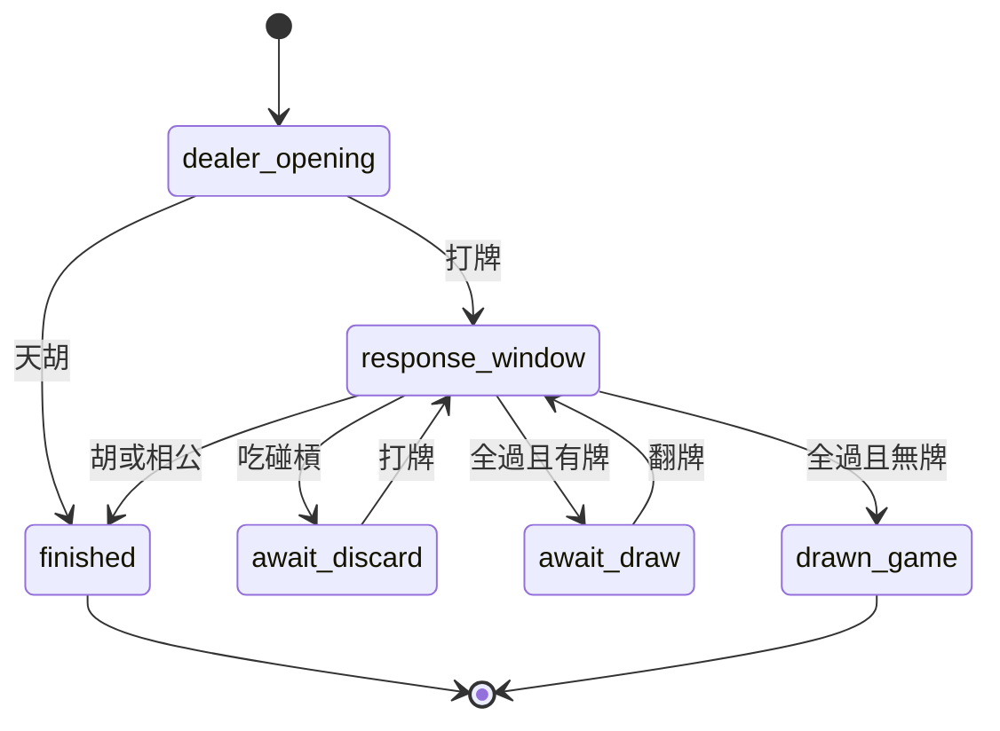
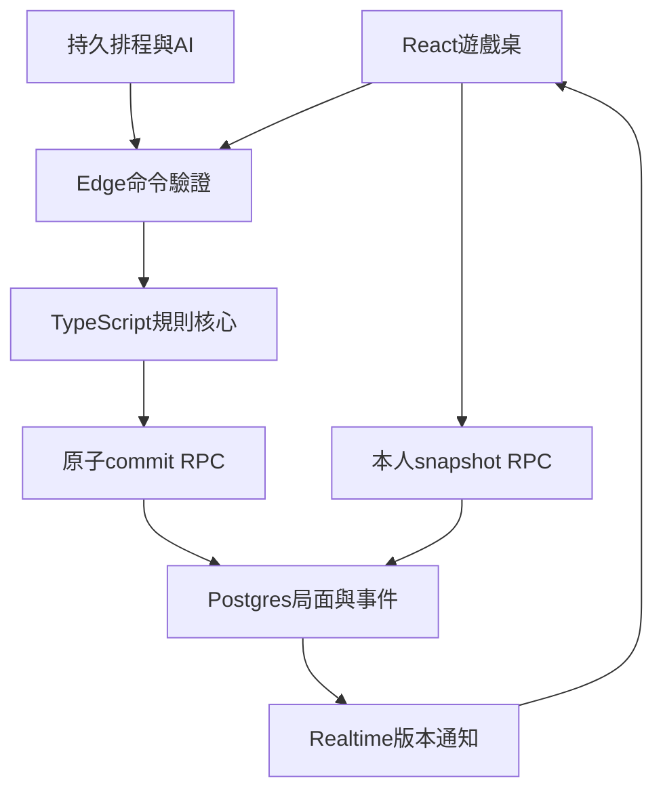

# 四色牌（10胡仔）跨平台對戰遊戲工程開發計畫

文件：`DEVplan.md`  
日期：2026-10-05  
技術：Vite + React + TypeScript + Supabase  
平台：iPhone、PC、iPad、Android Pad（瀏覽器／PWA）  
交付狀態：已建立本地練習與2–6席雲端真人／AI混合對戰、伺服器權威API、房間、私有Realtime及持久排程；部署與驗證見 `docs/DEPLOYMENT.md`。熟手、實機與規模驗收等剩餘條件見 `docs/IMPLEMENTATION.md`，不等同全部M7已完成。

> 本計畫專用於四色牌（10胡仔）。四色牌有地方規則差異；本文把來源、產品選擇與擴充玩法分開。2–4席採`tw10-product-v1`，5–6席採`tw10-extended-v1`。擴充模式仍以10胡為門檻，但不宣稱是通用傳統規則。所有規則須版本化並先以熟手玩家驗收fixture，再投入正式對局。

## 1. 產品範圍與交付標準

### 1.1 模式與人數

「單人」指一位真人，不是只有一個座位；一桌共有2–6席，真人與AI合計不超過6。多人支援2–6位真人及任意真人／AI混合配置。

| 模式 | 配置 | 執行與保存 | 要求 |
|---|---|---|---|
| 本地練習 | 1真人+1–5AI | Web Worker、IndexedDB暫局 | 可離線，無雲端競賽分 |
| 雲端單人 | 1真人+1–5AI | 伺服器權威、Supabase | 重新載入可恢復 |
| 好友房／混合桌 | 2–6真人，或至少1真人+AI | 伺服器裁決、Realtime | 邀請、準備、接管、重玩 |

第一個可玩垂直版本先做4席本地練習；完整v1必須完成2、3、4、5、6席的線上／AI混合桌，不能把5–6席留為未交付承諾。

必備功能：繁體中文、訪客身分、可選帳號綁定、建房／加入／準備／開始、AI難度、112張牌、吃碰槓胡過、公開翻牌、胡數明細、流局與相公、娛樂積分、跨平台選牌、斷線恢復、自己視角歷史紀錄、規則與安全測試。

v1不含：現金下注、公開排行、聊天／語音、觀戰、深度學習AI、雙副牌、麻將式補槓／搶槓、任意家規編輯器。資料留擴充點，功能不提前堆入核心。

## 2. 規則查證與選定原則

### 2.1 來源與差異

- [R1] 國史館臺灣文獻館介紹四色牌亦稱十胡，牌色為紅黃綠白，傳統牌搭2–4人。
- [R2] Board Game Arena提供一套2–4人的十胡版本，可核對112張、起手20／21張、公開翻牌與進牌概念。
- [R3] 國瑜牌具業者列出牌型胡數與地方玩法；其五人規則提到8胡，亦有強制胡／槓等規定，部分文字有歧義。

不存在由以上來源推得的唯一通用規則；不把九支仔、群胡、50胡等玩法混入本案。本文的API、狀態機與工程架構為自行設計。

### 2.2 本產品固定房規

| 項目 | 選定值 | 說明 |
|---|---|---|
| 胡牌門檻 | 基礎胡至少10 | 花胡不補足門檻 |
| 過胡 | 允許 | 同窗一旦選過不可改，與強制胡家規不同 |
| 一般槓 | 不強制 | 前端不藏強制規則 |
| 打將 | 禁止 | 伺服器與UI皆驗證 |
| 兵對、將碰 | 非獨立牌型 | 將可逐張算單將；兵對不成組 |
| 明組重拆 | 禁止 | 吃碰槓形成的組固定 |
| 多人胡 | 單一勝者、按來源席順位 | 不按網路速度 |
| 摸牌 | 翻出公開offer | 不先放入暗手，非一般麻將摸打 |
| 回合暗槓／補牌 | v1不提供 | 四同型在胡牌拆組時計暗槓；進牌不補摸 |
| 每局洗牌 | 全副重洗 | 不保留上局未用牌序 |
| 莊家初始天胡 | 允許，需完整≥10 | 產品明訂擴充 |
| 最後進張組明暗 | 當明組計胡 | 本產品計分選擇，地方可能不同 |
| 分數 | 零和娛樂分、可負分 | 不涉及金錢 |

### 2.3 房規驗收待辦

M0用熟手玩家確認：暗將槓6／明將槓8、最後進張明暗、可過胡、吃對、無合法打牌時相公、點花範圍、下一莊、5–6席發牌。本文已有可開發預設值；若改動，新增preset、fixture與版本，不以零散if覆蓋舊局。

## 3. 牌組、發牌、人數與設定

### 3.1 牌的資料定義

4色：`red/yellow/green/white`。7職別：`general/advisor/elephant/chariot/horse/cannon/soldier`，對應將士象車馬炮兵。每種顏色×職別4份，共112張。

字形可呈現帥／將、仕／士、相／象、俥／車、傌／馬、炮／包、兵／卒，但內部職別不變，不依文字判牌。同色同職別才是同型；4張紅車必須有4個實體ID。

### 3.2 各人數配置

| 席數N | 其他每人H | 莊家H+1 | 初發N×H+1 | 剩餘牌庫 | preset |
|---:|---:|---:|---:|---:|---|
| 2 | 20 | 21 | 41 | 71 | product-v1 |
| 3 | 20 | 21 | 61 | 51 | product-v1 |
| 4 | 20 | 21 | 81 | 31 | product-v1 |
| 5 | 16 | 17 | 81 | 31 | extended-v1 |
| 6 | 14 | 15 | 85 | 27 | extended-v1 |

六人若每人20張會需要121張，超過112，不能沿用。5–6席為本案單副牌擴充，保留足夠牌庫且仍採10胡；不等同[R3]的五人8胡。必須量測胡率／流局率，未達平衡時另訂擴充preset，不偷偷降低門檻。

單人預設四席（1真人+3AI），開局前可選2–6席。開局後N與手序固定，離席由AI控制原席，不刪除座位改環。

### 3.3 手序與莊家

邏輯seat為`0..N−1`，`nextSeat=(seat+1)%N`，畫面方位與手序分離。第一莊由伺服器安全亂數選出。逐張輪發H輪，再給莊家1張；產品選擇此發法。莊家進`dealer_opening`，可天胡，否則打出非將。

下一局：正常胡由勝者坐莊；流局／相公換上一莊下一席；全副重新洗牌。每局保存rulesHash與engineVersion。

### 3.4 RuleConfig

```ts
 type SeatCount = 2 | 3 | 4 | 5 | 6;
 type SeatId = 0 | 1 | 2 | 3 | 4 | 5;
 interface RuleConfig {
   presetId: 'tw10-product-v1' | 'tw10-extended-v1';
   version: 1;
   seatCount: SeatCount;
   baseHandSize: 20 | 16 | 14;
   minBaseHu: 10;
   allowSoldierPair: false;
   allowGeneralTriple: false;
   allowPassHu: true;
   mandatoryKong: false;
   generalDiscardable: false;
   incomingGroupExposure: 'exposed';
   multiWin: false;
   flowerEnabled: boolean; // 預設true
   flowerCountScope: 'winner_all_owned_cards';
   stakeUnit: 1; // 娛樂分最低每家1分
   responseTimeoutMs: 12000;
   discardTimeoutMs: 30000;
   drawTimeoutMs: 8000;
   reconnectGraceMs: 90000;
   shuffleEveryRound: true;
 }
```

`makeRuleConfig(N)`只建立表中的合法preset；server拒絕任意client handSize／胡數矩陣。遊戲中不能更換設定。

## 4. 遊戲流程、資格與行動裁決

### 4.1 offer與反應窗

每次桌面只有一張待處理`offer`，來源為`discard`（手打）或`open_draw`（公開翻牌）。每次建立固定window，玩家提交意向，伺服器收齊／到期後統一裁決；先按吃不能壓過期限內稍後的胡。

| 動作 | 他人打出 | 翻牌 | 自己需提供 |
|---|---|---|---|
| 胡 | 除出牌者外所有席 | 全部席含翻牌者 | 宣告；server自行拆組 |
| 槓 | 除出牌者外所有席 | 全部席 | 3張同型+offer |
| 碰 | 除出牌者外所有席；不可將 | 全部席；不可將 | 2張同型+offer |
| 吃 | 僅出牌者下一席 | 翻者與其下一席 | 合法吃組所需暗牌 |
| 過 | 有反應資格者 | 有資格者；翻將者有必收限制 | 無 |

吃組包括一般對、同色將士象／車馬炮、三／四色兵、單將。單將只會是公開翻出將（不可手打）；翻將者若未被更高優先動作取走，必須吃將，可以選合法將士象組，否則單將fallback。

### 4.2 排序規則

`胡 > 槓 > 碰 > 吃`。同級按來源環距：discard從下一席起，open_draw從翻者起。2–6席統一以N取模，禁止寫死四人方向。同牌僅4份，槓與碰通常不能同時合法，但仍定義排序避免靠巧合。

較低候選被優先取走是正常結果，UI顯示原因，不扣分。多人胡取順位首位，不用request先到者。

### 4.3 牌局循環

1. 莊家未天胡，暗手打一張非將到OFFER，開discard窗。
2. 合法胡優先：外來牌移入勝者結算牌，計胡與花，結束。
3. 吃／碰／槓：offer+指定暗手形成固定明組；取得者再打一張非將，開新窗。
4. 進牌後無暗手或無可打非將時，進行終局檢查：整體完整≥10則「進牌完成胡」；否則相公，不能卡住。
5. 全過：offer入棄牌，來源下一席取得翻牌權。
6. 翻牌取wall頂端到OFFER，開open_draw窗；不是先加入暗手。
7. 無人進則入棄牌，下一席翻；有進牌则進牌者出牌。
8. 最後一張仍完成反應；無人進且已無牌可翻才流局。

### 4.4 狀態機



發牌在建局交易內完成，成功才公開。finished區分win/xiang_gong/administrative_abort；維護中止不扣相公分。

### 4.5 反應窗政策

window保存UUID、offerId、來源、participantSeats、serverStartedAt與deadlineAt。participant集合由來源固定，不能把誰可胡公開。每席一筆最終意向，送出後不可改；無合法動作者由server預填PASS。

全席已確定可提前結窗，否則12秒到期。一般席逾時PASS；翻將者逾時合法必收fallback，明確違反必收的PASS拒絕。未裁決反應保持私密，公開只顯示「等待進牌判定」，不顯示誰正在選胡。

自動PASS只適用於精確確認沒有合法動作的席；solver回deferred時不得視為無可胡，需保留反應資格並續算。前端個人提示運算尚未完成時顯示處理中，不用空陣列暗示無牌可進。

## 5. 組合、胡數與結算

### 5.1 固定胡數表

胡數參考[R3]/[R2]，以下為本產品固定矩陣。暗＝胡時仍在暗手；明＝已固定桌面或最後進張所在組。

| kind | 組合 | 張數 | 暗 | 明 |
|---|---|---:|---:|---:|
| general_single | 單將／帥 | 1 | 1 | 1 |
| pair | 同色同職別兩張，不含將兵 | 2 | 0 | 0 |
| court | 同色將士象各一 | 3 | 2 | 2 |
| army | 同色車馬炮各一 | 3 | 1 | 1 |
| soldier_three | 三種不同色兵各一 | 3 | 3 | 3 |
| soldier_four | 四種色兵各一 | 4 | 5 | 5 |
| triple | 同型三張，不含將 | 3 | 3 | 1 |
| quad | 同型四張，不含將 | 4 | 8 | 6 |
| general_quad | 同型將四張 | 4 | 6 | 8 |

兩／三將可以拆成2／3個單將；不可當將碰。兵同色三張可碰、四張可槓，兵對不合法。同色四兵與四色兵是不同牌型。

### 5.2 胡牌條件與明暗

`fixedMelds + concealedHand + offeredCard`全部覆蓋成合法組，基礎Hu≥10。已固定明組不能重拆；暗手取最高分完整解。不能抽出10胡後剩孤兵仍喊胡。

不套用麻將的面子＋一對眼，也不要求結束總牌數恆為21。吃對與不同張數組、進牌再出牌會讓自有牌數動態改變；核心驗實體牌守恆而非固定胡牌張數。

天胡所有新組按暗；外來最後進張所在組按明，其餘新組按暗，固定桌面按明。本產品在此明確選擇，地方可能不同。

### 5.3 點花與分數

正常胡後可取wall頂牌到FLOWER；同色同職別比對勝者全部自有牌（明組、暗手與最後進張），每张同型+1花胡。點花本身不屬勝者、不參與拆組。

空堆改用本局第一張手打牌的type快照作花型，不搬動實體牌；若天胡無第一手牌則花0。基礎9加花3仍不合法。

```text
baseHu = 固定明胡 + 最高分完整拆組胡
totalHu = baseHu + flowerHu
perLoser = 1 + max(0, totalHu - 10)
winnerDelta = perLoser * (N - 1)
其他每席delta = -perLoser
```

4席12胡花0：每敗方−3，勝者+9；6席10胡：每敗方−1，勝者+5。流局全0；不另加放槍／自摸倍數。delta總和0，正常局一位winner，其餘未勝；不以剩牌數虛構順位。累積分可並列。

### 5.4 相公與錯誤操作

錯按胡／偽造牌／不合法吃：拒絕且state不變，不直接扣分。相公僅在server可證明的終局：進牌後應打牌但無非將可打且不足完整10胡，或非胡進牌導致暗手空而總胡不足10。

本產品相公席每家支付11娛樂分，總扣11×(N−1)，其他各+11；顯示推導。候選LegalOption標`terminalConsequence`，新手可隱藏或確認危險選項，但server仍處理。完整≥10且無暗手的合法終局則勝，不誤判相公。

### 5.5 畫面胡數

自己顯示明胡＋暗手最佳參考，不等於已胡；對手僅明胡。結果逐組明／暗、基礎／花胡、每家增減。教學反例含兵對、將三單、明暗槓差異。

## 6. 資料結構與不變量

### 6.1 牌、組與狀態型別

```ts
 type Color = 'red'|'yellow'|'green'|'white';
 type Role = 'general'|'advisor'|'elephant'|'chariot'|'horse'|'cannon'|'soldier';
 type TileTypeId = number; // 0..27，colorIndex*7+roleIndex
 type TileId = number; // 0..111，typeId*4+copyIndex
 interface Tile {id:TileId;typeId:TileTypeId;color:Color;role:Role}
 type Counts = readonly number[]; // length28，每格0..4，runtime驗證
 type MeldKind = 'general_single'|'pair'|'court'|'army'|'soldier_three'|'soldier_four'|'triple'|'quad'|'general_quad';
 interface Meld {
   id:string;ownerSeat:SeatId;kind:MeldKind;tileIds:readonly TileId[];
   exposure:'exposed';claimedOfferId:string;sourceSeat:SeatId;hu:number;
 }
 interface PartitionGroup {
   kind:MeldKind;typeCounts:Counts;includesIncoming:boolean;
   exposure:'concealed'|'exposed';hu:number;
 }
 type Phase = 'dealer_opening'|'await_draw'|'await_discard'|'response_window'|'finished'|'drawn_game';
 type Controller = {kind:'human';userId:string}|{kind:'ai';difficulty:'easy'|'normal'|'hard'};
 interface Offer {id:string;tileId:TileId;source:'discard'|'open_draw';originSeat:SeatId;createdAtMs:number}
 interface ReactionWindow {
   id:string;offerId:string;participantSeats:readonly SeatId[];
   startedAtMs:number;deadlineAtMs:number;
 }
 interface AuthoritativeState {
   gameId:string;boardVersion:number;engineVersion:string;rules:RuleConfig;
   phase:Phase;dealerSeat:SeatId;activeSeat:SeatId|null;
   controllers:readonly Controller[];
   wall:readonly TileId[];hands:readonly (readonly TileId[])[];
   melds:readonly Meld[];discards:readonly TileId[];
   offer:Offer|null;window:ReactionWindow|null;
   firstDiscardTypeId:TileTypeId|null;flowerTileId:TileId|null;
   result:RoundResult|null;
 }
 interface PublicSeat {
   seat:SeatId;name:string;controllerKind:'human'|'ai';
   handCount:number;melds:readonly Meld[];publicHu:number;
 }
 interface PublicSnapshot {
   gameId:string;boardVersion:number;rules:RuleConfig;phase:Phase;
   dealerSeat:SeatId;activeSeat:SeatId|null;wallCount:number;
   seats:readonly PublicSeat[];offer:Offer|null;window:ReactionWindow|null;
   discards:readonly TileId[];result:PublicRoundResult|null;
 }
 interface PlayerSnapshot {
   public:PublicSnapshot;viewerSeat:SeatId;hand:readonly TileId[];
   legalOptions:readonly LegalOption[];myResponse:ResponseReceipt|null;
   myResponseRevision:number;serverNowMs:number;
 }
```

公開結果只揭露勝者必要拆組與點花，不默認公開敗方暗手。不得把AuthoritativeState當React props／API response；snapshot用白名單建構，不以spread刪掉秘密欄位。

### 6.2 指令

```ts
 type ClaimIntent =
   | {kind:'pass'} | {kind:'hu'}
   | {kind:'claim';action:'eat'|'pong'|'kong';meldKind:MeldKind;handTileIds:TileId[]};
 type PlayerCommand =
   | {type:'discard';tileId:TileId}
   | {type:'open_draw'}
   | {type:'declare_opening_hu'}
   | {type:'respond';windowId:string;intent:ClaimIntent;responseRevision:number};
 type SystemCommand =
   | {type:'resolve_window';windowId:string;deadlineToken:string}
   | {type:'expire_turn';turnToken:string}
   | {type:'set_controller';seat:SeatId;controller:Controller};
```

actorSeat由JWT與membership推得，不相信payload中userId/seat。player route不能提交SystemCommand，AI走內部server route，不偽造真人JWT。

### 6.3 每次轉移的不變量

1. WALL+所有HAND+所有MELD+DISCARD+OFFER+FLOWER恰為112張唯一實體牌的分割。
2. 每type總數4，ID在0..111，沒有遺失／複製。
3. response_window恰有一張offer與一個window，其他階段無待處理window。
4. activeSeat在N席內；await_discard必有合法非將，否則應已終局。
5. offer僅一人取一次，取走後不可仍在棄牌／另一meld。
6. 固定meld不重拆，不含他人暗牌。
7. wall只在翻牌或點花減少，進牌不補摸。
8. boardVersion局面變更遞增，結果恰算一次且分數零和。
9. 結束拒絕新動作；重玩建立新gameId，不清空舊局事件。

## 7. 核心function清單

### 7.1 牌、設定與初局

| 函式 | 輸入→輸出 | 責任 |
|---|---|---|
| createDeck | →TileId[112] | 唯一全副 |
| decodeTile | ID→Tile | 範圍與catalog |
| toCounts | TileId[]→Counts | 實體ID不可重複 |
| makeRuleConfig | N→RuleConfig | 嚴格preset |
| validateRuleConfig | config→Result | 人數、起手、版本相容 |
| shuffleDeck | deck,uniformInt→新牌序 | Fisher–Yates、不偏整數亂數 |
| dealRound | deck,dealer,rules→hands+wall | N×H+1 |
| createInitialState | input→State | 莊家與開局 |
| sortHand | ids,mode→ID[] | UI順序不改權威所有權 |

### 7.2 組合與解算

| 函式 | 輸入→輸出 | 重點 |
|---|---|---|
| classifyMeld | types→kind/null | 張數、角色、同色 |
| getMeldHu | kind,exposure→number | 唯一胡數矩陣 |
| generateGroupPatterns | rules→Counts模板[] | 有限合法組 |
| enumerateGroupsContaining | type,counts→Pattern[] | anchor回溯 |
| findBestCompletePartition | hand,incoming,rules→SolveResult | exact最高分、全覆蓋 |
| evaluateHu | hand,offer,fixedMelds→HuEvaluation | 完整＋≥10 |
| getWinningTileTypes | PlayerRuleView→ListeningTile[] | 試28型、合法副數 |
| evaluatePartialHand | view→PartialHandMetric | heuristic，不冒稱精確向聽 |
| calculateFlowerHu | 自有牌,花型→number | 同type自有張數 |
| calculateScore | resultContext→ScoreDelta[] | 正常／流局／相公、零和 |

### 7.3 狀態與裁決

```ts
 getReactionParticipants(offer:Offer,n:SeatCount):SeatId[];
 getClaimPriority(intent:ClaimIntent):number;
 seatDistance(origin:SeatId,candidate:SeatId,source:Offer['source'],n:SeatCount):number;
 enumerateLegalClaims(view:PlayerRuleView):LegalOption[];
 validateDiscard(state:AuthoritativeState,seat:SeatId,id:TileId):RuleCheck;
 validateClaim(state:AuthoritativeState,seat:SeatId,intent:ClaimIntent):RuleCheck;
 rankClaims(claims:ValidatedClaim[],offer:Offer,rules:RuleConfig):ValidatedClaim[];
 resolveReactionWindow(state:AuthoritativeState,responses:ResponseMap,ctx:EngineContext):Transition;
 applyDiscard(state:AuthoritativeState,seat:SeatId,id:TileId,ctx:EngineContext):Transition;
 applyOpenDraw(state:AuthoritativeState,seat:SeatId,ctx:EngineContext):Transition;
 applyClaim(state:AuthoritativeState,winner:ValidatedClaim,ctx:EngineContext):Transition;
 checkPostClaimTerminal(state:AuthoritativeState,seat:SeatId):TerminalCheck;
 finishWin(state:AuthoritativeState,seat:SeatId,solve:HuEvaluation):Transition;
 finishDraw(state:AuthoritativeState):Transition;
 applyGameCommand(state:AuthoritativeState,command:VerifiedCommand,ctx:EngineContext):TransitionResult;
 assertStateInvariants(state:AuthoritativeState):void;
```

核心純函式不引用React、Supabase、fetch、Date.now或Math.random；ctx注入server時刻、預先產生的ID與測試亂數，事件足以重播。

服務函式另有：buildPublicSnapshot、buildPlayerSnapshot、buildAiObservation、loadAuthorityBundle、commitGameTransition、submitReactionIntent、readPlayerSnapshot、claimDueJobs、runAiJob、resumeGame、createRoom、joinRoom、setReady、addAiSeat、startRound、leaveRoom、transferHost。server-only repository不得從前端barrel export。

## 8. 拆牌、胡牌與聽牌演算法

### 8.1 使用exact-cover，不用貪心

先碰三同型可能破壞將士象／車馬炮；將單張可拆成槓；兵有同色與異色組。必須證明暗手全覆蓋與最高胡，而不是遇到合法組就刪掉。

以28維counts消除4副實體排列。pattern含單將、合法對、三／四同型、各色court/army、4種三色兵與1種四色兵。anchor固定第一個非零type，只枚舉含anchor的pattern避免重複拆組順序。

memo key用28字元字串／BigInt，加rulesHash與incomingRemaining；不能以JavaScript Number裝base5的5^28鍵，會超安全整數。

### 8.2 求解步驟

```text
solve(counts,incomingRemaining):
  counts全0且無incomingRemaining → 完整解Hu0
  memo命中→回傳
  anchor=第一個非0 type
  找全部含anchor且被counts包含的pattern
  若pattern包含incoming type：
    分支使用該最後進張，或使用同型暗牌
    使用incoming的組算明，其餘算暗
    不使用incoming時，剩counts必須仍能保留它
  遞迴剩牌，取最高Hu完整解
  同分以穩定pattern字典序決定
  所有分支失败→not_complete
```

最後進張與同型暗牌不可混淆。counts包含incoming的一張，但必须追蹤distinguished token使它恰屬一個明組。天胡沒有token。解出counts組後再按實體ID配置，精確放入incoming ID。

固定明組在外部累加，不重拆。空暗手是DP合法base case；能不能胡仍要查固定胡數與終局上下文。

### 8.3 複雜度與預算

最壞狀態空間上界5^28，不能聲稱O(28)保證瞬間。以≤21暗手、有限patterns、anchor、memo與上界剪枝縮小，測最壞fixture。

exact驗胡超時回deferred／重試，不回「不能胡」；AI近似不能代替權威驗胡。必要時凍结反應集合，持久job續算resolution_pending；若EdgeCPU始終不足，使用常駐worker，不採client結果。

### 8.4 聽牌與部分評分

逐一嘗試28type加一張exact solve；自有／已知同type滿4排除。顯示可胡型與基礎Hu；未見張數只是剩餘可能上界，不保證都在wall，因他人暗手未知。

部分評估允許skip anchor並罰未成組牌，輸出unmatchedCount、huPotential、搭子與可進型。稱「估計進牌潛力」，不冒稱麻將精確向聽數。提示Worker只收到自己手牌＋公開牌。

## 9. AI設計

### 9.1 合法觀測

```ts
 interface AiObservation {
   seat:SeatId;ownHand:readonly TileId[];public:PublicSnapshot;
   legalOptions:readonly LegalOption[];visibleTypeCounts:Counts;
 }
 interface AiDecision {command:PlayerCommand;policyVersion:string;rationaleCode:string}
```

policy只接受白名單observation，不能讀其他hands、wall順序或未裁決intent。server service role能讀不代表AI可用；先buildAiObservation再呼叫policy。

### 9.2 策略與function

| 難度 | 策略 | 決策CPU目標（待量測） |
|---|---|---|
| Easy | 有胡則胡；合法隨機，優先孤牌 | ≤20ms |
| Normal | 部分拆組評分、保10胡潛力、避相公 | ≤100ms |
| Hard試驗 | 公開觀測下未見牌型抽樣、1–2步期望 | ≤300ms |

function：chooseDiscard、chooseReaction、scoreHandPotential、estimateUnseenDistribution、simulateLegalContinuation、chooseFallbackAction、explainAiChoice。

評分參考：成組潛力＋Hu潛力＋可進型−未成組−拆好牌成本−相公風險−暴露成本。出牌同型僅評一次；將不候選。吃牌比較不同吃法與進後再打的結果，不只看當下吃幾Hu。

本地在Worker；線上job取觀測→選動作→相同驗證／交易。不在Edge sleep思考，400–900ms視覺延遲由dueAt。AI隨机測試固定seed，不讀生產洗牌seed。

### 9.3 模擬指標

每N、難度量測胡率、流局率、相公率、翻牌數、CPU與fallback；AI必須零非法動作。5–6席短手的10胡難度須從數據驗證，不能先聲稱平衡。

## 10. 系統架構與程式目錄

### 10.1 選用工具與職責

| 層 | 技術 | 職責 |
|---|---|---|
| Web | Vite+React+strict TypeScript | 響應式SPA，非權威server |
| 路由 | React Router | 大廳／房間／遊戲／教學／歷史 |
| 遠端資料 | TanStack Query | PlayerSnapshot、失效與重取 |
| 短暫UI | Zustand | 選牌、排序、彈窗、音效偏好 |
| Runtime驗證 | Zod | API、設定、ID與版本驗證 |
| 樣式 | CSS Modules+CSS variables | safe area、牌面、主題 |
| 後端 | Supabase Auth/Postgres/Realtime/Edge Functions | 身分、權威儲存、通知、命令 |
| 排程 | 持久job表+Supabase Cron | AI、deadline、恢復與outbox |
| 規則 | 共用game-core TS package | Web Worker／Edge／測試同一規則 |
| 品質 | Vitest/fast-check/Testing Library/Playwright/pgTAP | 核心、UI、權限、競態、E2E |

立項時依官方相容性選穩定版本，pin版本與lockfile；Node選符合Vite要求的受支持LTS。[T1] 不在文件猜未核對的「最新版本」。

### 10.2 資料流



Realtime是通知不是資料庫。收到board版本通知再讀一致snapshot；不讓房主瀏覽器當server。房主關閉也不停止AI或回合時鐘。

### 10.3 建議目錄

```text
four-color-game/
  apps/web/
    src/app/                  # router/providers/error boundary
    src/pages/                # home/lobby/room/game/history/tutorial
    src/features/auth/
    src/features/room/
    src/features/game/
      components/             # Table/Hand/Tile/Meld/ReactionBar
      hooks/                  # snapshot/realtime/command
      stores/                 # selection/layout/settings
      workers/                # local engine/hints
    src/lib/                  # supabase/queryKeys/logger
    src/styles/               # tokens/global/accessibility
    public/                   # manifest/icons/自製牌面
  packages/game-core/
    src/tiles/                # catalog/counts/deck
    src/rules/                # presets/patterns/hu/claims
    src/engine/               # phases/reducer/invariants/events
    src/solver/               # exactCover/memo/partition
    src/ai/                   # observation/policy/heuristic
    src/contracts/            # DTO/Zod/公開型別
    tests/fixtures/           # 核準房規與golden結果
  supabase/
    migrations/               # schema/RLS/RPC/jobs
    functions/_shared/        # server-only auth/repository
    functions/game-command/
    functions/room-command/
    functions/job-dispatch/
    tests/                    # pgTAP/RLS/RPC
  tests/e2e/
  scripts/                    # sim/benchmark/fixture驗證
  DEVplan.md
```

pnpm workspace，game-core為無Node專屬API的ESM純TS；Edge需相容Deno的import／bundle。M1先做Web與Edge共同import的build proof，避免後期alias或套件不相容。核心不可直接依賴資料庫，adapter執行IO。

## 11. Supabase資料模型與SQL

### 11.1 公開與私密分層

- `public`：房間與安全局面，不含暗手、牌庫序、未裁決意向。
- `private`：完整權威state、實體位置、反應、內部事件、job與receipt；不在Data API exposed schemas。
- 客戶端以身分限定snapshot RPC讀自己暗手；server-only commit只對後端角色授權。

### 11.2 資料表

| 表 | 欄位重點 | 約束／目的 |
|---|---|---|
| public.profiles | user_id、display_name、avatar_seed | 名稱1–20字、可改欄位白名單 |
| public.rooms | id、host_user_id、seat_count、status、rules、revision | N=2..6、未開局可改配置 |
| public.room_members | room_id、user_id、seat、ready、joined_at | unique(room,seat)、unique(room,user) |
| public.room_ai_seats | room_id、seat、difficulty | 與真人席不可衝突，room鎖內檢查 |
| public.games | id、room_id、round_no、board_version、phase、public_snapshot、rules_hash、engine_version | unique(room,round_no)、單行安全投影 |
| public.game_members | game_id、user_id、seat、membership_status | 開局身分快照，不隨離房抹除 |
| public.game_events | game_id、public_seq、event_type、payload、created_at | 僅安全公開事件 |
| public.game_results | game_id、seat、reason、base_hu、flower_hu、score_delta | unique(game,seat)、一次結算 |
| private.room_invites | room_id、code_hash、expires_at | 原始邀請token不公開 |
| private.game_authority | game_id、board_version、state_json、state_hash、resolution_token | 完整wall/hands、內部解析狀態 |
| private.tile_locations | game_id、tile_id、zone、seat、meld_id、wall_order | PK(game,tile)、112列守恆投影 |
| private.game_responses | game_id、window_id、seat、intent、response_revision、accepted_at | unique(window,seat)、私密反應 |
| private.command_receipts | scope_id、actor_key、key、request_hash、response_json | unique(scope,actor,key)、網路重試 |
| private.internal_events | game_id、seq、command、context、result_hash | 完整server replay，不暴露暗牌 |
| private.jobs | id、game_id、kind、token、due_at、lease_until、attempt、status | durable工作與重試 |
| private.outbox | id、game_id、board_version、safe_payload、sent_at | commit後通知可重試 |

state_json是權威聚合；tile_locations是同交易產生的約束／稽核投影，不是另一套可任意修改的權威。public_snapshot也是安全投影，不能接client patch。快照、位置、事件、結果與job每次一併commit。

### 11.3 SQL骨架（正式migration仍需補完）

```sql
create schema if not exists private;
revoke all on schema private from anon, authenticated;

create table public.games (
  id uuid primary key default gen_random_uuid(),
  room_id uuid not null references public.rooms(id),
  round_no integer not null check (round_no > 0),
  board_version bigint not null default 0 check (board_version >= 0),
  phase text not null,
  public_snapshot jsonb not null,
  rules_hash text not null,
  engine_version text not null,
  started_at timestamptz not null default now(),
  ended_at timestamptz,
  unique (room_id, round_no)
);

create table private.game_authority (
  game_id uuid primary key references public.games(id),
  board_version bigint not null,
  state_json jsonb not null,
  state_hash text not null,
  resolution_token uuid
);

create table private.game_responses (
  game_id uuid not null references public.games(id),
  window_id uuid not null,
  seat smallint not null check (seat between 0 and 5),
  intent jsonb not null,
  response_revision integer not null default 1,
  accepted_at timestamptz not null default clock_timestamp(),
  primary key (window_id, seat)
);

create table private.tile_locations (
  game_id uuid not null references public.games(id),
  tile_id smallint not null check (tile_id between 0 and 111),
  zone text not null check (zone in ('WALL','HAND','MELD','DISCARD','OFFER','FLOWER')),
  seat smallint check (seat between 0 and 5),
  meld_id uuid,
  wall_order integer,
  primary key (game_id, tile_id)
);
```

需加phase enum/check、所有FK、cardinality、closed-window constraints、grants、RLS、index與測試。跨表112張不是單一CHECK可以保證；commit RPC驗證分割，PK防一ID多位置。JSON與locations一致也在同RPC檢查。

### 11.4 索引與保存

room_members(user_id,room_id)、game_members(user_id,game_id)、games(room_id,round_no desc)、event(game_id,seq) unique、receipts(scope,actor,key) unique、responses(game_id,window_id)。jobs(due_at)待處理partial index；批量掃描不用每次全表。

事件例如90天可配置、結果長期保存；活躍局、未過重試期receipt不可刪。刪帳號不cascade整局，需匿名化保留結果與稽核。

## 12. Auth、RLS、秘密隔離與Realtime

### 12.1 身分與跨裝置

本地練習可免登入，線上Supabase匿名Auth給真正user ID；匿名Auth是authenticated角色，與未登入anon不同。[T3][T7] 綁Email/OAuth才能跨裝置可靠恢復；未綁訪客清資料可能失去身分，不承諾靠房號取回自己的手牌。

房號用來找到房間，不是身分憑證。兩tab同帳號同席可以看同快照，但第一個合法動作生效，另一tab顯示已由其他裝置操作。

### 12.2 權限矩陣

| 資源 | 未登入 | 本局成員 | 非成員 | 後端 |
|---|---|---|---|---|
| 房間摘要 | 不直接列所有私房 | 自己房只讀 | 受控join流程 | 管理 |
| 局面／公開event | 無 | select | 無 | 寫入 |
| 自己暗手 | 無 | 本人snapshot | 無 | 白名單建構 |
| 他人／AI暗手與wall | 無 | 無 | 無 | 存取 |
| 未裁決意向 | 無 | 只讀本人receipt | 無 | 裁決 |
| mutation表 | 無 | 禁直接DML | 無 | RPC commit |
| profile | 無 | 受限欄位更新 | 只見安全名稱 | 管理 |

RLS限制row，不會自動隱藏同row私密JSON欄位，故分schema。view要檢查security_invoker／受控function；不可依賴UI遮牌。[T3]

### 12.3 安全snapshot RPC

`public.get_my_game_bundle(p_game_id)`以單一SQL SELECT／CTE讀同版public、本人hand與本人response，避免多個READ COMMITTED statement跨版本；用auth.uid找席，不接受任意user_id。使用SECURITY DEFINER時`search_path=''`、全限定schema、membership檢查；revoke PUBLIC/anon預設EXECUTE，只grant authenticated。[T2]

DB回傳安全的PlayerReadBundle，不在SQL內假裝執行TypeScript解算器。game.snapshot的Edge read adapter以bundle的本人手牌＋公開局面呼叫共用core，補legalOptions後形成PlayerSnapshot；衍生選項與bundle同版本。server不能從帶service role的呼叫直接期待auth.uid是使用者；應用已驗證使用者的JWT呼叫受控read RPC，或用另一個server-only loader明確傳入並重驗actor。前端若直接讀bundle亦僅含自己的安全資料，不會取得authority。

private表不grant client。server-only commit、job lease、authority loader一律不grant authenticated。測REST、RPC、view、Realtime；server key可繞RLS，server code也必須先JWT授權。

### 12.4 私有Realtime

- topic `game:<gameId>`，config.private=true；messages policy查當局membership。
- broadcast安全payload只有gameId、boardVersion、publicSeq；pending intents、牌庫、暗手絕不進channel。
- client不能送看似權威的state_changed，presence僅顯示在線，不決定座位／回合／離線超時。
- 按官方授權文件配置；不重設平台已開RLS的realtime.messages、不亂改realtime schema。[T6]
- 授權有連線快取；移除成員需處理topic與重新授權。下一局新gameId。核心秘密始終由snapshot當下membership檢查。

### 12.5 金鑰、洗牌與反作弊

前端使用publishable key（舊專案anon key亦可），secret/service_role只在server；VITE_*皆視為公開，不存server key。查bundle與source map不含秘密。[T8]

洗牌用安全亂數、不偏uniformInt、Fisher–Yates；不信任client牌序。可存高熵deck commitment稽核，但它單獨不證明公平；v1不公開完整seed，避免還原他人暗手。未來commit–reveal需另定協定與揭露同意。

user/room/IP rate limit、payload大小、重複ID、未知欄位、邀請碼猜測限制。邀請碼hash保存且過期；不只靠六位短碼當私房唯一安全屏障。

## 13. API、交易、併發與冪等性

### 13.1 API契約

| API | request | response／授權 |
|---|---|---|
| room.create | N、preset、名稱、key | roomId、invite、房規 |
| room.join | inviteCode、key | seat或滿房 |
| room.set_ready | ready、roomRevision | 房間版本 |
| room.set_ai | seat、difficulty、revision | 未開始且房主 |
| room.start | revision、key | 配置合法、全員ready→gameId |
| room.leave | roomId、key | 未開始釋席／開局接管 |
| game.command | gameId、boardVersion、command、key | receipt、安全snapshot |
| game.snapshot | gameId | 本人PlayerSnapshot |
| game.history | cursor、limit≤50 | 本人結果與安全歷史 |

```ts
interface CommandRequest {
  gameId:string;expectedBoardVersion:number;
  idempotencyKey:string;command:PlayerCommand;
}
type ApiResult<T> =
  | {ok:true;data:T;requestId:string}
  | {ok:false;code:ErrorCode;message:string;requestId:string;currentBoardVersion?:number};
```

### 13.2 TypeScript核心＋原子SQL commit

Edge內多次supabase.update不是跨呼叫transaction。流程：

1. 驗JWT找actor，載一致authority與server時間。
2. 查scope/actor/key receipt；同hash回原結果。
3. 核心對state做驗證與transition，產nextState、公投影、event、jobs/outbox。
4. 呼叫server-only commit_game_transition，含expectedVersion、key、hash與verified patch。
5. SQL鎖該局authority行（SELECT FOR UPDATE），再查receipt，比boardVersion與phase/token。
6. 原子寫authority、locations、public、event、result、jobs與receipt；任一失敗回滾。
7. 檢查112分割／位置一致，boardVersion+1，提交後由outbox通知。

JS運算不假裝發生在資料庫鎖內；CAS防讀算寫期間競態。player衝突回STALE_VERSION，不盲目重送失效牌；系統job可重讀重算。patch只能來自可信後端，不將可接收client nextState的RPC暴露。

### 13.3 同窗意向雙版本

同窗多人PASS／吃不應互相造成STALE：每筆意向只寫game_responses與本人responseRevision，**不遞增boardVersion**；局面只在裁決改變。

commit_reaction鎖同局行，驗window仍開、boardVersion吻合、clock_timestamp()<deadline、該席尚無意向；原子寫private response與receipt，不broadcast其意向。不同key但已有意向回RESPONSE_ALREADY_LOCKED。

resolver鎖同局、凍結responses、設internal resolutionToken，之後core計裁決再CAS commit。若兩階段分離，commit需驗同token與responsesHash；durable resolving job可恢復，不能凍結後崩潰永遠卡窗。所有新反應在凍結後拒絕。

deadline邊界採DB持鎖驗證時clock_timestamp；等於deadline已過期，不用clientNow、HTTP送出時刻或transaction開始時刻。all-responded可在截止前凍結。

### 13.4 冪等與錯誤

key唯一(scope/game,actor,key)，same key不同request hash→IDEMPOTENCY_KEY_REUSED。未知網路結果重送沿用key，新選動作才換key。結束局也先查已成功receipt，再回GAME_FINISHED，使先成功後斷線能查回。

至少定義：UNAUTHENTICATED、NOT_MEMBER、ROOM_FULL、ROOM_NOT_READY、NOT_HOST、UNSUPPORTED_RULES、STALE_VERSION、NOT_YOUR_PHASE、NOT_YOUR_TURN、CARD_NOT_OWNED、DUPLICATE_TILE_ID、GENERAL_NOT_DISCARDABLE、INVALID_MELD、NOT_ELIGIBLE_TO_EAT、HU_BELOW_THRESHOLD、HAND_NOT_COMPLETE、WINDOW_CLOSED、RESPONSE_ALREADY_LOCKED、PASS_FORBIDDEN、GAME_FINISHED、RATE_LIMITED、RESOLUTION_DEFERRED。

validation不重試；網路5xx limited backoff，不自動换key。legalOptions是提示非權限票據，server重新驗。

## 14. 持久排程、超時、斷線與恢復

### 14.1 job機制

每次窗、出牌／翻牌截止、AI思考與離線接管建立private.jobs，含dueAt、gameId、kind、turn/window token。單一Cron每秒掃到期job，短批次呼叫Edge worker；不每局一個cron。官方Cron支援秒級，但HTTP冷啟動仍需量測。[T4]

claim_due_jobs以FOR UPDATE SKIP LOCKED與lease；worker崩潰lease到期重試。job token不合目前階段即obsolete。at-least-once由receipt與CAS防重複；ack與遊戲變更尽量同transaction。

Edge背景setTimeout有生命週期／CPU限制，不可靠承擔整局長時鐘。[T5] 不sleep15分鐘等反應。Cron/Edge不能達SLO時，使用常駐TS worker消費同job表，不重寫規則與Supabase核心。

### 14.2 超時表

| 場景 | 時限 | fallback |
|---|---:|---|
| 反應 | 12秒 | PASS／翻將合法必收 |
| 出牌 | 30秒 | 公平AI選合法非將或終局檢查 |
| 翻牌 | 8秒 | server自動翻 |
| 斷線grace | 90秒 | 原回合仍按時；期滿controller改AI |

grace不等於全桌暫停90秒。恢復真人控制只在安全階段邊界，不能覆蓋AI已鎖定的同窗意向。翻將必收fallback亦須遵循更高優先胡／槓裁決。

### 14.3 重連順序

1. 用原session，顯示連線中禁送。
2. 先private channel SUBSCRIBED，再取snapshot；期間通知buffer最大版本。
3. buffer比snapshot新就再取，避免先讀再訂閱的缺口。
4. gameId+boardVersion替換remote；本人responseRevision單獨刷新。
5. 清掉不再屬自己之選牌，過時動畫不重播、舊window不用。
6. serverNow估顯示時差，倒數僅顯示，server判定。

reload、回前景、channel重連皆重取；可5–10秒低頻校驗，不能只靠Broadcast永久交付。snapshot須單次一致讀public與hand。

### 14.4 房主與生命週期

等候室房主離開轉最早真人；無真人則短期關房／恢複。開局後房主不裁決，離開只改controller。下一局真人重新ready，避免全AI無限重開耗資源。

## 15. React頁面、元件、Hooks與資料流

### 15.1 路由

| 路由 | 頁面 | 內容 |
|---|---|---|
| / | HomePage | 本地／線上／教學 |
| /lobby | LobbyPage | 建房／加入／正在參與 |
| /room/:roomId | RoomPage | N席、ready、AI、房規 |
| /game/:gameId | GamePage | 本人視角，不以URL seat取暗牌 |
| /practice | PracticePage | 本地engine、明示練習 |
| /history | HistoryPage | 本人結果與安全event |
| /tutorial | TutorialPage | 牌型、10胡反例、操作 |

### 15.2 元件

| 元件 | props | 功能 |
|---|---|---|
| GameShell | snapshot、connection | safe area／載入／錯誤 |
| ResponsiveTable | N、viewerSeat、public seats | 不寫死4方向 |
| SeatPanel | PublicSeat、active | 名稱、牌數、AI、明胡 |
| MeldRack | Meld[]、compact | 固定明組分組展示 |
| OfferPanel | Offer、window、clock | 最新offer、来源、截止 |
| WallPanel | count、canDraw | 明確翻牌，不洩順序 |
| DiscardDrawer | discards | 已棄牌與型count |
| HandRack | hand、selection、sort | 雙排／捲動／焦點 |
| TileButton | Tile、selected、disabledReason | 觸控字形與aria |
| DiscardActionBar | selectedId、canSubmit | 出牌預覽、確認、取消 |
| ReactionActionBar | LegalOption[]、locked | 胡槓碰吃過 |
| MeldChoiceSheet | options | 多種吃法選一組 |
| HuBreakdownDialog | HuEvaluation | 完整分組、10胡明細 |
| RoundResultDialog | result | 分數／重玩／回房 |
| RuleSummary | rules | 人數、手牌、房規差異 |
| ConnectionBanner | status | 禁送與恢復 |

Hooks：useSession、useRoomSnapshot、usePlayerSnapshot、useGameChannel、useGameCommand、useServerClock、useHandSelection、useLegalOptions、useHintWorker、useLocalGame、useDocumentVisibility、useReducedMotion、useAudioPreference。

useGameChannel只通知重取；useGameCommand集中key、送出鎖、receipt與錯誤。元件不直接DML牌局。

### 15.3 狀態分層

Query固定key `['game',gameId,userId]`，版本在response，避免每版本留下暗手cache。Zustand只選牌／UI；Worker派生提示或本地局。登出／換帳號清Query、訂閱與選牌。

出牌悲觀更新：禁送、提交中，收到權威接受才移牌。較舊board不覆蓋新snapshot；同board但myResponseRevision較新仍可更新本人鎖定receipt。

## 16. 跨平台畫面與操作

### 16.1 布局

| 裝置 | 對手與桌面 | 手牌 |
|---|---|---|
| iPhone直式320–430px | 頂部N−1席縮略，中央offer，點席開明組drawer | 分色兩行／水平捲動，底部固定操作 |
| iPhone橫式 | 上／左右短席標籤 | 1–2行，不強迫旋轉 |
| iPad/Android直式 | 對手／中央／手牌三區 | 雙排，吃法sheet |
| 平板橫式 | 2–4席四向，5–6席環形／上多席 | 大牌面、明組展開 |
| PC ≥1024 | 桌面＋右公開紀錄 | 滑鼠、鍵盤、胡數明細 |

不要將20張窄牌塞360px成十幾px命中。手機依色分列、至少44px觸控区域與清楚字形，可scroll-snap；實體重複副本用小點區分但不改規則。

relativeSeat=(seat-viewerSeat+N)%N，本人置底；getSeatLayout(N,orientation,viewport)只決定顯示位置，nextSeat仍是領域邏輯。6席手機用縮略與drawer，不把5家明組擠滿中央。

### 16.2 操作防誤送

點牌僅選取，第二次取消；出牌單選，吃選完整候選預覽。主鍵明示「打出紅車」「吃紅將士象」。拖動捲牌不觸發click，雙點只送一次，送出禁按。

鍵盤方向移焦點、Space選、Esc取消；Enter只在出牌button已聚焦時送，不因選牌中的Enter立即出牌。意向鎖定顯示「等待裁決」，不得仍暗示可改胡。

### 16.3 CSS與平台基準

100dvh配100vh fallback、safe-area、min-height:0、局部overflow；整頁無橫向溢出。旋轉保持phase、選牌與window。房間文字输入字級至少16px減少iOS放大，對局不彈文字鍵盤。

產品測試基準先訂iOS/iPadOS Safari16.4+及仍受維護的Chrome/Edge/Firefox/Safari；最終M1/M7以實機確認。核心不依賴安裝PWA、fullscreen、hover、震動或音效。

## 17. 牌面、動畫、聲音與無障礙

自製SVG／DOM牌面，字形與色／職別分離；精確漢字不靠生成圖片。不拷貝其他遊戲美術，確認字體授權與system fallback。

色盲友善用顏色＋紅黃綠白文字／圖紋，白牌不是白字白底；測對比。TileButton以aria-pressed、label朗讀「紅色車，已選取」。回合用aria-live polite，不每秒朗讀倒數。200%縮放與reduced-motion仍可玩。

公開event動畫按gameId+publicSeq去重，翻牌150–250ms、進牌200–350ms，opacity/transform為主。第一次手勢初始化音效，可關，失敗仍文字提示。切背景不保證聲音／震動，回前景重同步。

## 18. 本地練習、PWA與版本

### 18.1 Gateway

```ts
interface GameGateway {
  getSnapshot():Promise<PlayerSnapshot>;
  submitCommand(req:CommandRequest):Promise<CommandReceipt>;
  subscribe(listener:(s:PlayerSnapshot)=>void):()=>void;
  dispose():void;
}
```

CloudGateway API；LocalGateway Worker持權威state，走同規則與裁決。練習在本機devtools可看牌，不宣稱反作弊。練習標明且不寫雲端競賽分；雲端掉線不自動轉本地假稱同步。

### 18.2 Cache與更新

service worker只cache靜態殼、icons、manifest。Auth／snapshot／REST／WebSocket／含牌API不通用cache。練習IndexedDB獨立namespace帶schemaVersion+engineVersion；提供清除暫局。

遊戲中新版提示延後，不強制reload。新局用新engine，舊局按已存version兼容路由；不以最新規則重播舊事件。部署相容migration先新增再遷移，不改活躍局房規。

## 19. 測試矩陣與具體案例

### 19.1 牌型golden fixtures

| 輸入 | 預期 |
|---|---|
| 紅將士象 | court、2Hu |
| 紅車馬炮 | army、1Hu |
| 紅黃綠兵 | soldier_three、3Hu |
| 紅黃綠白兵 | soldier_four、5Hu |
| 紅兵×2 | 非pair，無其他組則不完整 |
| 紅將×3 | 3個單將共3Hu，非triple |
| 紅車×3 | 暗3／明1 |
| 紅車×4 | 暗8／明6 |
| 紅將×4 | 暗6／明8，和4單將比較 |
| 紅車+黃馬+綠炮 | 非army |

胡牌最小基線：紅車×4暗8+黃將1+綠將1＝完整10Hu。已固定紅車明槓6＋兩單將只有8，不能重算暗8。完整9Hu即使花可能加3仍不合法。

各發牌配置可胡的存在性fixture（不是自然胡牌率保證）：

| 莊家手數 | 完整暗手範例 | 最高Hu基線 |
|---:|---|---:|
| 21（2–4席） | 紅車4、黃馬4、綠炮4、白士4、紅將4、綠將1 | 39 |
| 17（5席） | 紅車4、黃馬4、綠炮4、白士4、紅將1 | 33 |
| 15（6席） | 紅車4、黃馬4、綠炮4、白將3 | 27 |

正式fixture另外建20／16／14暗手+外來最後進張的胡案例、正常常見手牌、進後完成胡與空手不足10。每type不超4，每副本ID唯一。

### 19.2 solver測試

- exact solver對照小牌數暴力oracle，不能只用同演算法的輸出當expected。
- 相同type副本交換／輸入排序改變不改最高Hu。
- 未完整不能忽略孤兵；多解取最大Hu，incoming所在組明暗有专門golden。
- 固定明組不重拆；空暗手是合法DP base，但終局另檢Hu。
- invalid counts、同型>4、重複ID、base5精度、rules cache版本全測。
- budget deferred不等於not_complete；裁決不錯誤PASS掉合法胡。
- 對每種合法pattern測明／暗Hu與自動生成反例（錯色、少一、角色錯、重複兵色）。

### 19.3 engine與優先序

對N=2/3/4/5/6逐一測發牌、環距與下一席。非當前出牌、將被打、他人ID、重複ID拒绝且state不變。discard不能回收自己牌，吃只有下一席；open_draw吃翻者與下一席。

吃vs碰→碰、碰vs胡→胡；兩胡按環距，不因request順序。翻者同級優先；翻將不可PASS，別家合法胡／槓仍能優先。最後一牌可胡，全過wall0流局。吃牌只搬offer一次，不既在meld又在棄牌。

進牌無可打時：完整≥10胜，否則相公，不停在await_discard。same-window意向不可改，舊window跨期拒絕。天胡無第一棄牌且空花fallback正確。

### 19.4 性質測試與自動局

fast-check生成合法手牌／state／指令；每transition驗§6.3。非法指令無state變動。同初態、verified command與ctx replay同終態hash；最多finish一次，score總和0。

每N至少1,000局固定seed自動牌局，定期10,000局；失敗記seed與最小反例。測試不用生產安全亂數。驗證不是靠AI剛好沒走到錯誤分支，也需人造邊界fixture。

### 19.5 DB、API與競態

| 情境 | 驗證 |
|---|---|
| 多席同窗提交 | 意向全能寫，不相互STALE，單一裁決 |
| 同帳號兩tab同時出牌 | 只有一個局面transition |
| same key重送 | 原receipt，事件與分數不重複 |
| same key不同body | IDEMPOTENCY_KEY_REUSED |
| commit中途失敗 | authority/location/public/result/jobs全部回滾 |
| commit後回應斷線 | 重試拿原成功結果 |
| deadline−1ms、相等、+1ms | 持鎖DB時刻接受／拒绝符合規格 |
| resolver與新意向並發 | 凍結前有效者納入，後拒絕 |
| 兩worker拿同job | lease、token、receipt防重複 |
| worker崩潰 | lease到期恢復，卡窗會告警 |
| snapshot與commit並發 | public與本人hand讀同board |
| 通知漏發／亂序 | 重取可恢復，舊版不覆新 |

用A/B/C三帳號：A/B同局，C非成員。A不能REST/RPC/view讀B或AI暗手；C不能局面與channel。authenticated/anon不能execute server-only RPC。檢查payload、event、log與前端bundle無hands/wall/pending intents/server key。

### 19.6 UI／E2E／實機

Playwright多context測2/4/6真人與混合AI；viewport320×568、390×844、768×1024、1024×768、1440×900。驗建房、同時join滿房、ready、翻、吃法選擇、過、截止、胡數、相公、重玩與斷線。

模擬viewport不能代替實機：至少iPhone Safari、iPad Safari、Android平板Chrome、Windows Chrome/Edge各完整一局。背景切回、旋轉、捲牌誤點、靜音、弱網、reload、200%字級皆測。

## 20. 效能、監控、部署與維運

### 20.1 初始SLO（須量測）

正常網路command接受至snapshot p95≤1秒；截止或收齊到裁決顯示p95≤2秒，冷啟動另記。Normal AI CPU p95≤100ms；exact solver真實基準p95≤50ms，最壞目標≤500ms。未達標優化運算，不降低正確性。

提示不得阻塞手機主執行緒，使用Worker與局部rerender。初始JS gzip目標≤300KB，歷史、教學與Hard AI lazy load；依依賴實測修正。edge memory／CPU與Supabase方案限制部署前重查。

### 20.2 監控

command latency、CAS conflicts、illegal commands、window resolution lag、job lag／lease recovery、solver deferred、AI fallback、Realtime reconnect、胡／流局／相公率。log帶requestId/gameId/windowId/version，不印JWT、暗手、wall、email與server keys。

凍结window超過5秒／job lag>10秒告警；staging可先structured logs與admin health endpoint。告警不自動重送玩家過時動作，管理維护中止按不扣分處理。

### 20.3 CI、部署與回滾

CI順序：lint→strict typecheck→core unit/property→Web/Edge build→DB migrations/pgTAP→API race→核心E2E。本地Supabase CLI stack，staging/production分開項目與環境變數。

前端部署HTTPS、SPA fallback與版本資產靜態主機；Supabase選靠近主要玩家區域，量測Edge與DB跨區延遲。本文僅計畫，沒有建立或發佈外部服務。

schema只有migration，不手改正式表。兼容式發版、活躍局version鎖定、保留上一版前端和function；DB回滾不等於app回滾，先staging演练備份恢復。Cron/job/outbox納入健康檢查。

### 20.4 容量與成本

起始staging壓測50同時房間、最多300席，再依需求放大。約12秒offer窗，每桌最多約5offer/min、每次至多N意向，另含出牌、snapshot與notice；提早結窗可能更快，要以實測估算峰值。

invocations估算activeRooms×offers/min×平均回應席＋draw/discard/jobs；乘snapshot次數與payload估傳輸。依當期Auth/Realtime connections/messages/Edge/DB quota評成本，不假設免費無限。避免每席每秒poll全快照；Cron只扫due、批次限量。

## 21. 里程碑、工單與估時

### 21.1 里程碑

| 階段 | 單人工作日估計 | 交付／退出條件 |
|---|---:|---|
| M0 房規與UX | 3–5 | preset、熟手fixture、2–6席wireframe |
| M1 骨架 | 3–4 | workspace、Web/Edge雙build、Auth、本地DB、CI |
| M2 胡牌核心 | 6–9 | patterns、exact solver、score、oracle、benchmark |
| M3 engine與AI | 5–7 | window/reducer、Easy/Normal、每N千局模擬 |
| M4 本地可玩 | 5–7 | React桌、Worker、結算、2–6席UI |
| M5 雲端安全 | 7–10 | schema/RLS、snapshot、CAS、receipt、競態 |
| M6 多人與排程 | 6–9 | 房間、Realtime、jobs、截止、重連／接管 |
| M7 硬化／發佈準備 | 5–7 | 實機E2E/load、PWA、監控與回滾 |

共40–58工作日，單人約8–12週，未含大量美術／社群功能。關鍵路径M0→M2→M3→M5/M6→M7；可按團隊分工重排，但每階段有可操作demo。

### 21.2 可建issue的任務

| ID | 任務 | 依賴 | DoD |
|---|---|---|---|
| RULE-01 | preset／發牌與胡數 | 無 | 表與golden一致 |
| RULE-02 | catalog/counts | RULE-01 | 112唯一、28×4 |
| RULE-03 | patterns/Hu | RULE-02 | 合法／非法全矩陣 |
| SOLVE-01 | exact＋incoming | RULE-03 | oracle與明暗golden |
| SOLVE-02 | 聽牌／評估Worker | SOLVE-01 | 非阻塞與版本cache |
| ENGINE-01 | phase與不變量 | RULE-02/03 | 全transition守恆 |
| ENGINE-02 | claims/rank | ENGINE-01 | 所有N/来源/優先序 |
| AI-01 | Easy/Normal | SOLVE-01/ENGINE-02 | 合法觀測、無非法動作 |
| UI-01 | Table/Hand/Tile/Meld | RULE-02 | 20+牌手機可讀 |
| UI-02 | reaction／吃法 | ENGINE-02 | 鎖定、截止、防誤送 |
| DB-01 | schema/projections | ENGINE-01 | migrations可重建 |
| SEC-01 | grants/RLS/snapshot | DB-01 | A/B/C的allow/deny |
| API-01 | command/CAS/receipt | SEC-01 | race／冪等 |
| ROOM-01 | lobby/ready/start | API-01 | 6人並發join不超席 |
| RT-01 | private channel／重連 | API-01 | 訂閱競態不漏新版 |
| JOB-01 | deadline/AI/outbox | API-01 | 崩潰恢復、token過期 |
| QA-01 | 實機與弱網 | UI-02/RT/JOB | 完整驗收報告 |
| OPS-01 | CI/PWA/監控／回滾 | QA-01 | staging演練 |

## 22. 驗收、風險與未來功能

### 22.1 完整v1 DoD

1. 本地／雲端單人、2–6真人與AI混合桌從建局到胡／流局／相公皆完整，能重玩。
2. 每N千局sim無112張守恆、錯席、重複結算與無終局卡死。
3. 核準fixture包含各preset可胡與實際多人案例，胡數明細可核對。
4. 同窗人數不造成互相STALE，優先級不依網路速度。
5. DB/API/channel/bundle/log均不洩他人暗手或server秘密。
6. 沒前端在線仍完成AI與deadline，worker崩潰可恢復。
7. 四平台實機可讀可選牌，無關鍵按鈕被遮或整頁溢出。
8. 同身分reload可恢復，舊window不可套新局。
9. 分數零和、single result、歷史rules/engine可回放。
10. 關鍵CI/staging通過，部署配置、監控、回滾可重現。

### 22.2 風險表

| 風險 | 對策 |
|---|---|
| 地方規則不同 | 独立preset＋熟手fixture，歧義不拼接 |
| 六人發牌超112 | N與handSize綁定，擴充模式明示 |
| 短手10胡難度 | 模擬率＋真人測，不冒稱已平衡 |
| solver最壞case | exact oracle、memo、budget deferred與worker備案 |
| 多人喊牌競態 | 固定window、回應雙版本、鎖與CAS |
| 暗牌JSON／事件洩漏 | 分schema、白名單、權限與網路測試 |
| Edge冷啟動／timer | durable jobs、秒級sweep／常驻worker |
| Safari背景暂停 | server時間、回前景快照 |
| 新版改舊局 | rules/engine鎖定、相容migration |

### 22.3 未來擴充

家規preset（五人8胡、強制胡／槓、兵對）、Hard AI、教程、好友與配對、觀戰、回放、Capacitor封裝。先定合法性與visibility再做UI。雙副牌需改copy數、ID、Hu、優先候選與守恆，不能只deck倍增。

## 23. 第一個Sprint與補充契約

### 23.1 Sprint 1（約兩週）

- 房規矩陣與至少30個golden，含incoming、將、兵、5–6席。
- Vite react-ts、workspace、strict、Vitest、CI與Web/Edge import proof。
- catalog、counts、patterns、Hu、exact solver與score。
- 簡版reducer、固定seed CLI模擬，UI先展示fixture手牌。
- demo：輸入手牌＋固定明組＋offer，顯示最佳拆組、合法動作、拒絕原因。

先核心→權威安全→多人排程→視覺細節。不要先排行榜，再由UI救規則錯誤。

### 23.2 重要契約

```ts
interface RuleError {code:ErrorCode;reason:string}
type RuleCheck = {ok:true}|{ok:false;error:RuleError};
type WinSolveResult =
  | {status:'complete';groups:PartitionGroup[];concealedAndIncomingHu:number}
  | {status:'not_complete'}
  | {status:'deferred';reason:'budget_exceeded'};
type HuEvaluation =
  | {status:'eligible';baseHu:number;groups:PartitionGroup[]}
  | {status:'below_threshold';baseHu:number;groups:PartitionGroup[]}
  | {status:'not_complete'}
  | {status:'deferred'};
interface LegalOption {
  id:string; // 僅提示識別，不是server授權票據
  command:PlayerCommand;
  previewTileIds:readonly TileId[];
  huIfWinning?:number;
  terminalConsequence?:'win'|'xiang_gong';
}
interface ResponseReceipt {
  windowId:string;acceptedAtMs:number;intent:ClaimIntent;
  responseRevision:number;locked:true;
}
interface CommandReceipt {
  idempotencyKey:string;requestHash:string;
  accepted:true;boardVersion:number;snapshot:PlayerSnapshot;
}
interface ScoreDelta {seat:SeatId;delta:number}
interface RoundResult {
  reason:'win'|'draw'|'xiang_gong'|'administrative_abort';
  winnerSeat:SeatId|null;penaltySeat:SeatId|null;
  baseHu:number;flowerHu:number;totalHu:number;
  groups:readonly PartitionGroup[];scores:readonly ScoreDelta[];
}
interface EngineContext {
  nowMs:number; // 注入server或測試時刻
  generatedIds:readonly string[];
}
interface Transition {
  nextState:AuthoritativeState;
  publicEvents:readonly SafeGameEvent[];
  internalEvents:readonly InternalGameEvent[];
  jobs:readonly JobSpec[];
}
type TransitionResult = {ok:true;transition:Transition}|{ok:false;error:RuleError};
```

以上為設計骨架，不是完整可編譯app；ErrorCode、SafeGameEvent、JobSpec等在contracts補齊並Zod驗證。RuleError僅包含失敗資訊，HuEvaluation用discriminated union，deferred不被誤解為不能胡。PublicRoundResult採RoundResult的明確白名單投影，不得加入其他玩家暗手或內部解析資料。

### 23.3 裁決偽碼

```text
resolve(window,state,responses):
  重新確認offer/window token及已凍結候選集合
  每意向以權威hands與rules驗證
  非法意向不進排序；有deferred胡驗證則持久續算，不先裁別人吃
  按(priority desc, seatDistance asc)排序
  若首位胡：完成最高分拆組→結算
  若首位claim：移牌到固定meld→檢進後終局→等待出牌
  若無勝出而翻將者有必收：補合法單將fallback再檢終局
  否則offer入discard，wall空則流局，不空則來源下一席翻
  assertStateInvariants(nextState)
  原子commit並建安全通知
```

fallback不應在其他合法胡／槓之前執行；候選不存在與延後精確驗證必須區分。

### 23.4 ADR決策記錄

房規preset、最後進張明暗、5–6發牌、局面／response雙版本、Edge core＋SQL atomic commit、持久jobs、private schema、snapshot白名單、PWA cache範圍、舊局版本路由。每個ADR記問題、選擇、替代與驗證證據。

## 24. 參考資料與查核範圍

查核日期2026-10-05。來源用來確認玩法差異與技術能力；API、型別、演算法設計、排程、UI與估時為本專案工程決策，不拷貝其他遊戲圖像、文案或程式。

- [R1] [國史館臺灣文獻館：四色牌](https://dict.th.gov.tw/Print.aspx?ID=2186)：名稱、牌色與傳統2–4人背景。
- [R2] [Board Game Arena：四色牌說明](https://zh.doc.boardgamearena.com/Gamehelpfourcolorcards)：一套可操作十胡版本、公開翻牌與進牌概念。
- [R3] [國瑜企業社：四色牌玩法](https://www.guoyu.com.tw/zh/qa/1.html)：胡數、五人8胡與強制動作差異，不作唯一通用標準。
- [T1] [Vite Getting Started](https://vite.dev/guide/)：react-ts初始化與Node相容。
- [T2] [Supabase Database Functions](https://supabase.com/docs/guides/database/functions)：RPC、安全模式與EXECUTE權限。
- [T3] [Supabase RLS](https://supabase.com/docs/guides/database/postgres/row-level-security)：grant、row政策與view注意事項。
- [T4] [Supabase Cron](https://supabase.com/docs/guides/cron)：秒級排程、SQL／HTTP任務，不保證端到端延遲。
- [T5] [Supabase Edge Limits](https://supabase.com/docs/guides/functions/limits)：CPU／memory／生命週期，部署前再核對。
- [T6] [Supabase Realtime Authorization](https://supabase.com/docs/guides/realtime/authorization)：private channel、messages RLS與連線快取。
- [T7] [Supabase Anonymous Sign-Ins](https://supabase.com/docs/guides/auth/auth-anonymous)：匿名Auth與帳號綁定。
- [T8] [Supabase API Keys](https://supabase.com/docs/guides/getting-started/api-keys)：publishable／secret及舊key。
- [T9] [Supabase Broadcast](https://supabase.com/docs/guides/realtime/broadcast)：安全版本通知。

正式開發先核準M0 fixture，再按M1–M7交付。後續規則與架構更動更新同一文件並保留版本原因。
